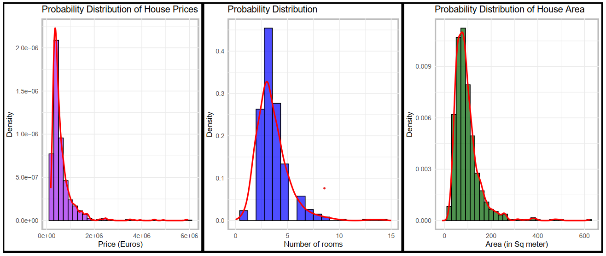
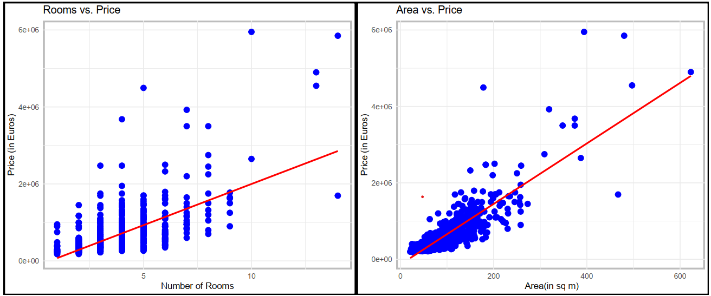
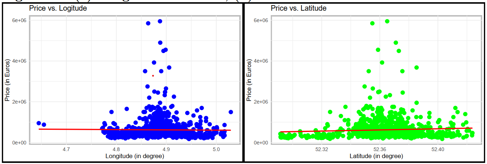
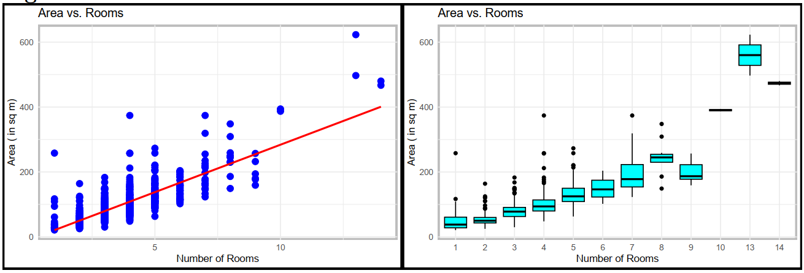
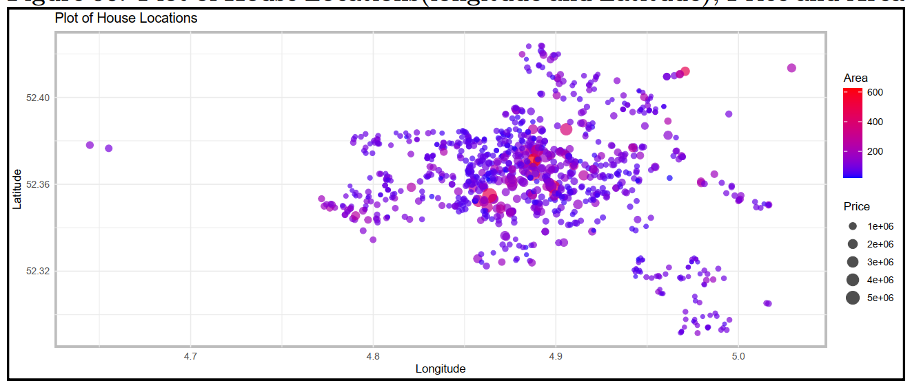
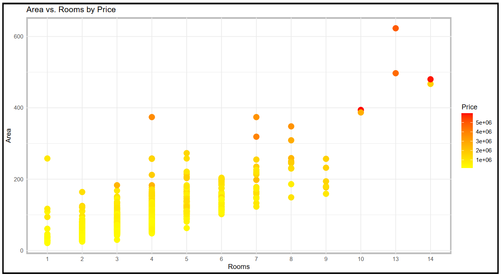

#### Amsterdam-House-Price-Analysis-and-Prediction

# From Data to Dwellings: Decoding Amsterdam's Housing Prices 

## Abstract
This project aims to analyze and predict **housing prices in Amsterdam** using data from August 2021. The primary goal is to **identify trends affecting housing prices**. By analyzing predictors such as property area, number of rooms, and geographic location, the project will explore relationships through exploratory data analysis (EDA). A predictive model, using statistical and machine learning techniques, will be developed to estimate prices and provide insights into the market.
 
 

## Introduction
The Amsterdam housing market has recently undergone significant fluctuations due to various factors like economic conditions, demographics, and housing policies. Understanding these factors is vital for buyers, sellers, and investors. 
By examining predictors such as property area, number of rooms, and geographic location (longitude and latitude), this project will use exploratory data analysis (EDA) to visualize relationships and assess their impact on prices. The goal is to evaluate whether these predictors can be used in a predictive model to estimate house prices and forecast market trends. By applying statistical and machine learning techniques, the project aims to offer insights into the Amsterdam housing market for practical use in decision-making.

## Exploratory Data Analysis with Visualisation

Here, we identify **trends** of various fields in our dataset by conducting univariate, bivariate, and multivariate data analyses. Univariate analysis helps to **summarize individual variables**, bivariate analysis **explores relationships between two variables**, while multivariate analysis examines interactions between **multiple variables to uncover deeper patterns and insights** influencing housing prices.

### Figure 01. Histogram of (a) Price, (b) number of rooms and (c) Area of House

### Figure 02. (a) Number of Rooms vs Price of House and (b) Area vs Price of House 

### Figure 03. (a) Longitude vs Price , (b) Latitude vs Price 

### Figure 04. Plots between Area vs Rooms

### Figure 05. Plot of House Locations(longitude and Latitude), Price and Area 

### Figure 06. Plot of Rooms vs Area coloured by Price

## Conclusion and Discussion
This project successfully analyzed and predicted housing prices in
Amsterdam by examining a comprehensive dataset from August 2021. Through
univariate, bivariate, and multivariate data analyses, we identified
significant trends and correlations between various predictors such as
area, number of rooms, and geographic location.

-   **Rooms and Area vs. Price**: Area and number of rooms are the
    strongest predictors of price. 
-   **Rooms and Area**: Rooms and Area are highly correlated
-   **Latitude and Longitude vs. Price**: Location plays a role but is
    less influential than area and room count.
-   **Correlation of Variables**: The strong correlation between area,
    rooms, and price suggests a linear relationship, making a linear
    regression model a suitable choice for prediction. Latitude and
    longitude can also be included to improve model accuracy.

The **strong positive correlation** between the `Area` and `Price`, as
well as the moderate correlation with `Rooms`, indicates that a linear
relationship may exist between these variables and house prices. This
suggests that a **linear regression model could provide a solid baseline
for predictions**. Also, other predictors identified during the EDA ,
such as `Longitude` and `Latitude`, can be included as independent
variables in the linear model. These features have shown significant
relationships with house prices and are likely to contribute
meaningfully to the model's accuracy.
